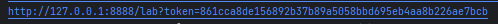
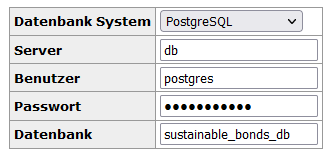

# Metrics of Sustainable Bonds
## Intro
Sustainable debt security instruments (bonds) are increasingly becoming one focus of the extensive sustainable finance discussion worldwide. Bonds with a specific, sustainable purpose (e.g. Green Bonds (GB)) as well as bonds with a general purpose but linked to one or more sustainability goals (Sustainability Linked Bonds (SLBs)) are becoming increasingly popular on the capital market (as shown in figure 1). The decline in 2022 is due to the overall difficulties in the bond market due to increasing interest rates. An important driver of this trend over the last two years is the demand from the (private-) investor side.

## Goal:
In this project, we try to find differences in the sustainable bonds and the financials of the issuing companies. The main question is if there is a connection between the type of sustainable bond and the financial performance, size, cash flow, and profitability. The biggest challenge for this project is that data availability is restricted to users with access to common data providers, like Bloomberg or Refintitv Eikon. First, we therefore document the process of fetching the data from these platform for others to update or recreate our findings. Secondly, we provide the data downloaded on the date of this project for those without access to the data platforms.

go to [walkthrough](./Data/green_metrics_sustainable_bonds.ipynb) for results.

## walkthrough

We are running everything in a Docker container. Everything is handled in the docker-compose file. 
IMPORTANT: change the Volumes path in the docker-compose to point to your file location, so all changes you do in the jupyter notebook are directly saved. Otherwise you have to upload the files and changes are not saved.

then you can simply start the container with:
```bash
docker-compose up --build
```
It will start an instance of postgres, jupyter and adminer to see the postgres tables.

Now you can head to the jupyter notebook using the link including the token:



In the jupyter notebook you can open `work` and the file `excel2sql.ipynb`. stepping through it will transfer your data into a SQL-Table. 

You can then see your data table in the adminer. To do so, you have to got o the port 8080 in your browser: `http://localhost:8080`. You will then see a login window, where you have to input the following parameters:



The password is `sustainable`.

In the work folder, there is a second jupyter notebook called `green_metrics_sustainable_bonds.ipynb`. You can now step through the cells to see the results.
